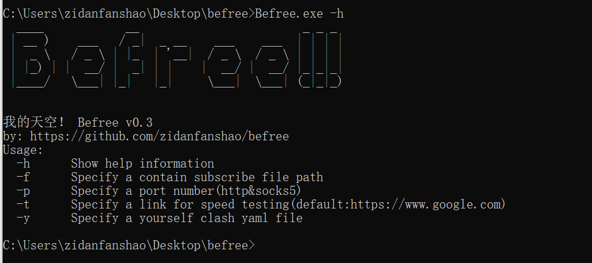
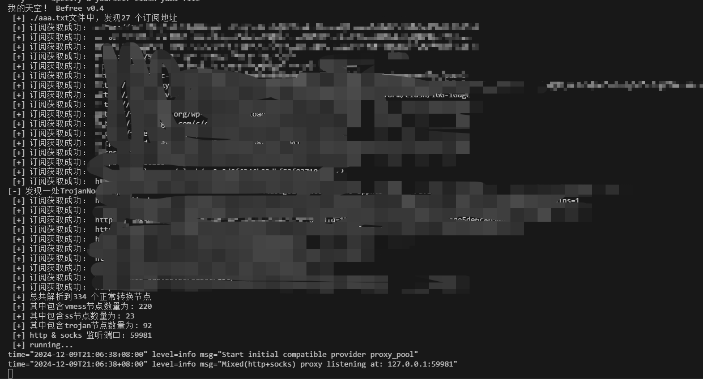

# Befree

一款通过轮询各类订阅中节点的代理池工具。        如果刚好满足你的需求，可以点个star✨支持一下

看了v2rayN、sstap等工具之后，发现很多类似的工具基本都是套了个壳，最后还是调用clash、xray等代理工具。

网上买各种代理池又可贵，于是为了操作方便以及代理池的需求，有了这款工具。通过解析订阅中各个节点，重新生成clash配置文件，调用clash，进行节点轮询，达到代理池的效果。

本来打算调用clash这部分也重新写一下，后来发现很多协议、很多加解密类型，太繁琐，造轮子有点麻烦，于是最后决定还是直接调用clash。

release中的文件包含了一个clash，如果怕存在病毒，可以直接下载源码修改befree.csproj以及clashrunner.cs中的clash文件路径至自己的clash。


## 编码环境

.net8


## 利用方法

```
  -f      Specify a file path						指定存在订阅的txt文件
  -p      Specify a port number(http&socks5) 		指定代理监听端口
```


## 利用效果

#### 运行



#### 指定订阅文件，指定监听端口 查询节点



#### 目录扫描

调用dirsx进行扫描效果


*注意：使用结束后，记得手动关闭clash进程*

## 当前支持协议

| 协议类型 | 是否支持               |
| -------- | ---------------------- |
| vmess    | 支持√                  |
| trojan   | 支持√                  |
| ss       | 支持√                  |
| ssr      | 解析存在问题，下次更新 |

